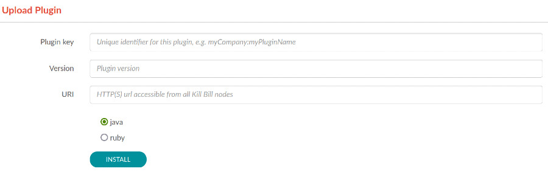
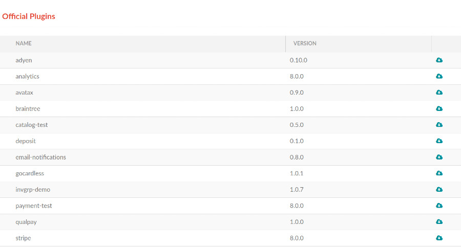

# KPM OSGI bundle

The KPM OSGI bundle enables:

* the `INSTALL` and `UNINSTALL` commands of the [Kill Bill plugins management APIs](https://github.com/killbill/killbill-docs/blob/v3/userguide/tutorials/plugin_management.adoc)
* endpoints specific to [KPM UI](https://github.com/killbill/killbill-kpm-ui)

The osgi bundle installation location will follow Kill Bill's `org.killbill.osgi.bundle.install.dir` configuration property, 
and use `/var/tmp/bundles` if this property is not set.

## Configuration

_Note: In this document, do not confuse with term `repository` vs `*.kpm.nexusRepository`. `repository` is where plugin, 
or JAR files hosted and can be downloaded, while `*.kpm.nexusRepository` is additional configuration to set construct 
complete nexus URL._

See complete KPM configuration in [configuration](CONFIGURATION.md) document. This document contains default values and 
comments that might be useful to set configuration that suit your need.

### Configuration Best Practice

The best way to set KPM/plugin configuration is to not set anything. KPM plugin already set default value for common use 
case, (See `KPMProperties.java`) so you don't have to. Only configure anything when it doesn't suit your needs.

### Kill Bill Custom Repository

Currently, KPM Plugin only tested custom plugin repository against Cloudsmith and GitHub. It is possible to set to
another repository, as long as they're public repository (like custom sonatype installation), or private
repository with [Basic Authentication](https://en.wikipedia.org/wiki/Basic_access_authentication).

In KPM Plugin, there are 2 types of repositories:

1. Kill Bill custom installation repository. This is where you set repository if you have custom Kill Bill version. 
   This is KPM plugin will look at if `latest` parameter set to `true`. 
   The configurations path are:
   ```properties
   org.killbill.billing.plugin.kpm.nexusUrl=https://dl.cloudsmith.io/<any>/killbill/<account>
   org.killbill.billing.plugin.kpm.nexusRepository=maven
   ```
   Configuration above will try to get killbill information from URI: `https://dl.cloudsmith.io/<any>/killbill/<account>/maven`
   You can set `*.kpm.nexusAuthMethod|nexusAuthUsername|nexusAuthPassword|nexusAuthToken` as needed. If your repository 
   not following sonatype/maven conversion and need to set custom location for  `nexus-metadata.xml` file, you can set 
   it via `*.kpm.nexusMavenMetadataUrl` configuration.

2. Killbill Plugin repository. This is a repository of your plugins. You can set custom plugin repository by using 
   `*.kpm.pluginInstall.coordinate.*` configurations. You can set `kpm.pluginInstall.coordinate.alwaysTryPublicRepository` 
   configuration to allow KPM plugin to use Kill Bill public repository as a fallback just in case the plugin is not found. 

### About `plugins_directory.yml` File

The `plugins_directory.yml` contains list of plugins that available to download via "Coordinate based plugin installation". 
You can see default value and format of the file 
[here](https://raw.githubusercontent.com/killbill/killbill-cloud/master/kpm/lib/kpm/plugins_directory.yml). To customize 
`plugins_directory.yml` location, you can use following configurations:

```properties
org.killbill.billing.plugin.kpm.pluginsDirectory.url=URL
org.killbill.billing.plugin.kpm.pluginsDirectory.authMethod=NONE|BASIC|TOKEN
org.killbill.billing.plugin.kpm.pluginsDirectory.authUsername=VALID_USERNAME
org.killbill.billing.plugin.kpm.pluginsDirectory.authPassword=VALID_PASSWORD
org.killbill.billing.plugin.kpm.pluginsDirectory.authToken=VALID_TOKEN
```


## Installing a plugin

There's 2 ways to install plugins via KPM plugin. After KPM platform bundles installed correctly in bundles path, go to
`<kaui-host>/kpm/plugins`. For example, `http://localhost:9090/kpm/plugins`. 

### Installing plugin by uploading a plugin



Installing plugin using upload form is the easiest way to getting started with Kill Bill plugin to install any plugin. 
Just fill the form and valid plugin URI to download, and then you can start installing them.

However, this is not recommended approach in production, for following reasons:

1. No verification and validation performed: There is no file integrity verification options. There is no validation 
   against current Kill Bill Version. Coordinate based plugin installation give you more fine-grained check whether 
   plugins is compatible or not with current Kill Bill version against 
   [plugins_directory.yml](https://raw.githubusercontent.com/killbill/killbill-cloud/master/kpm/lib/kpm/plugins_directory.yml) file.

2. It doesn't always support microservices/multiple Kill Bill instance installation.

### Coordinate based plugin installation



Installing plugin via coordinate is the recommended way to install a plugin. You can install plugin just by clicking 
"install" button in plugin list. While installing official plugin as easy as clicking "install" button, installing 
your own plugins/custom plugins is not as straightforward as using form-based plugin installation. 

To install plugins from different repository, you can set `*.kpm.pluginInstall.coordinate.*` configuration properly. If 
`*.kpm.pluginInstall.coordinate.*` not set, plugin installation will use `kpm.nexus<XXX>` as default configuration values.

#### Example

If you set this configuration:

```properties
org.killbill.billing.plugin.kpm.pluginInstall.coordinate.url=https://maven.pkg.github.com/xsalefter/killbill-hello-world-java-plugin
org.killbill.billing.plugin.kpm.pluginInstall.coordinate.authMethod=BASIC
org.killbill.billing.plugin.kpm.pluginInstall.coordinate.authUsername=<username>
org.killbill.billing.plugin.kpm.pluginInstall.coordinate.authPassword=<github_classic_personal_access_token>
org.killbill.billing.plugin.kpm.pluginInstall.coordinate.alwaysTryPublicRepository=true
```

Then KPM plugin will try to download plugin from `maven.pkg.github.com`. Because `*.coordinate.alwaysTryPublicRepository` 
is set to `true`, KPM Plugin will try to find plugin from Official Kill Bill public repository 
(`https://repo1.maven.org/maven2/org/kill-bill/billing/plugin/java/`)

## Endpoints

List available plugins:

```
curl -v \
     -u admin:password \
     http://127.0.0.1:8080/plugins/killbill-kpm/plugins?kbVersion=<LATEST|ANY_VERSION>&latest=true
```

1. `kbVersion` parameter will let KPM plugin whether it should download the latest Kill Bill version in repository. 
2. `latest` parameter will translate into `forceDownload` method parameter in `PluginManager.java`. Keep parameter name 
   as is to keep backward compatibility. setting this value to true means KPM Plugin will download plugins/plugins  
   information in each request. Note that `availablePlugins.cache.enabled` will take precedence over `forceDownload`. 
   Setting `cache.enabled=false` means KPM plugin will always download plugins and plugins information.
